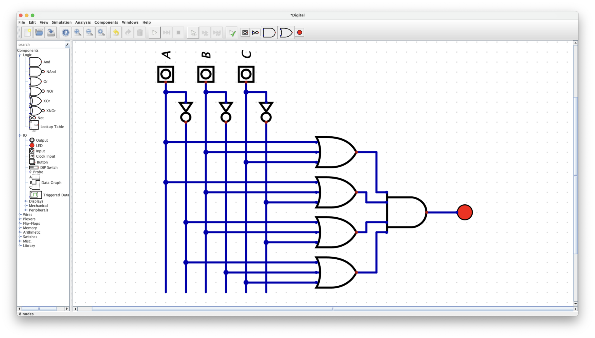

## Table of Contents

- [Truth Table](#truth-table)
- [Sum of Products (SOP) หรือ Min-terms](#sum-of-products-sop-หรือ-min-terms)
- [Product of Sums (POS) หรือ Max-terms](#product-of-sums-pos-หรือ-max-terms)
- [Example](#example)
  - [Sum of Products (SOP)](#sum-of-products-sop)
  - [Product of Sums (POS)](#product-of-sums-pos)

## Truth Table

`Truth Table` คือ ตารางที่ใช้สำหรับแสดงความจริงของฟังก์ชันตาม Input ที่รับเข้ามา

|$A$|$B$|$C$|$\text{Minterm}$|$\text{Maxterm}$|$f(A, B, C)$|
|:---:|:---:|:---:|:---------:|:---------:|:-----------:|
|$0$|$0$|$0$|$m_0 = A'B'C'$|$M_0 = A+B+C$|$0$|
|$0$|$0$|$1$|$m_1 =A'B'C$|$M_1 = A+B+C'$|$0$|
|$0$|$1$|$0$|$m_2 = A'BC'$|$M_2 = A+B'+C$|$1$|
|$0$|$1$|$1$|$m_3 = A'BC$|$M_3 = A+B'+C'$|$1$|
|$1$|$0$|$0$|$m_4 = AB'C'$|$M_4 = A'+B+C$|$1$|
|$1$|$0$|$1$|$m_5 = AB'C$|$M_5 = A'+B+C'$|$0$|
|$1$|$1$|$0$|$m_6 = ABC'$|$M_6 = A'+B'+C$|$0$|
|$1$|$1$|$1$|$m_7 = ABC$|$M_7 = A'+B'+C'$|$1$|

โดยจำนวนแถวจะเท่ากับ $2^n$ โดยที่ $n$ คือจำนวนข้อมูล Input

## Sum of Products (SOP) หรือ Min-terms

เราจะเลือกเฉพาะ $f(A, B, C)$ ที่มีค่าเป็น 1 มาเขียนเป็น product term แล้วนำมา OR กัน

### ตัวอย่าง

(ทั้ง 3 ตัวอย่างมีความหมายเหมือนกัน)

- $f(A, B, C) = (A'BC') + (A'BC) + (AB'C') + (ABC)$
- $f(A, B, C) = m_2 + m_3 + m_4 + m_7$
- $f(A, B, C) = \Sigma m(2, 3, 4, 7)$

## Product of Sums (POS) หรือ Max-terms

เราจะเลือกเฉพาะ $f(A, B, C)$ ที่มีค่าเป็น 0 มาเขียนเป็น sum term แล้วนำมา AND กัน

### ตัวอย่าง

(ทั้ง 3 ตัวอย่างมีความหมายเหมือนกัน)

- $f(A, B, C) = (A+B+C) \cdot (A+B+C') \cdot (A'+B+C') \cdot (A'+B'+C)$
- $f(A, B, C) = M_0 \cdot M_1 \cdot M_5 \cdot M_6$
- $f(A, B, C) = \Pi M(0, 1, 5, 6)$

## Example

### Sum of Products (SOP)

### Product of Sums (POS)

