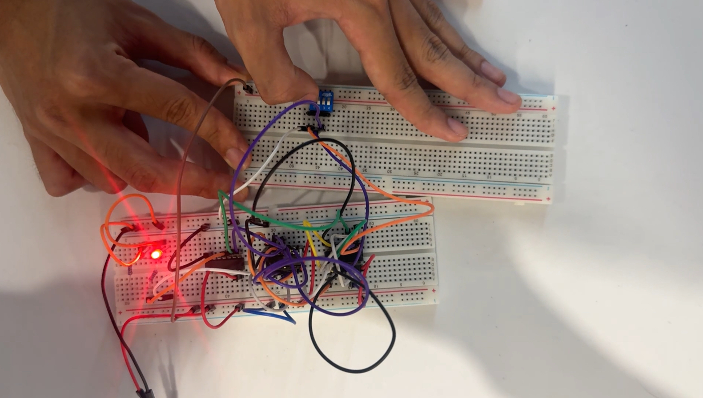
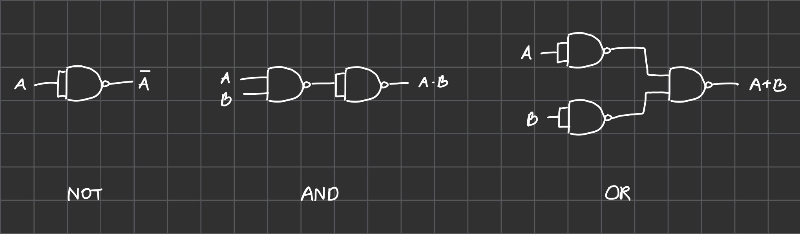
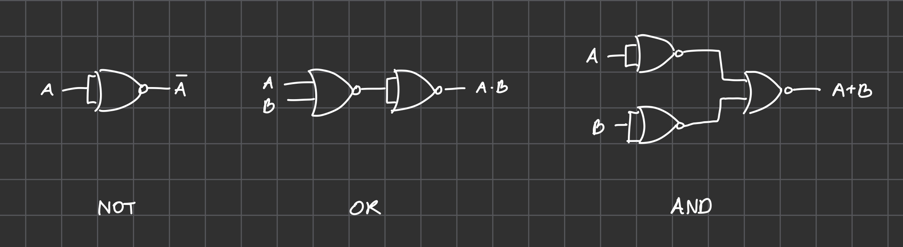
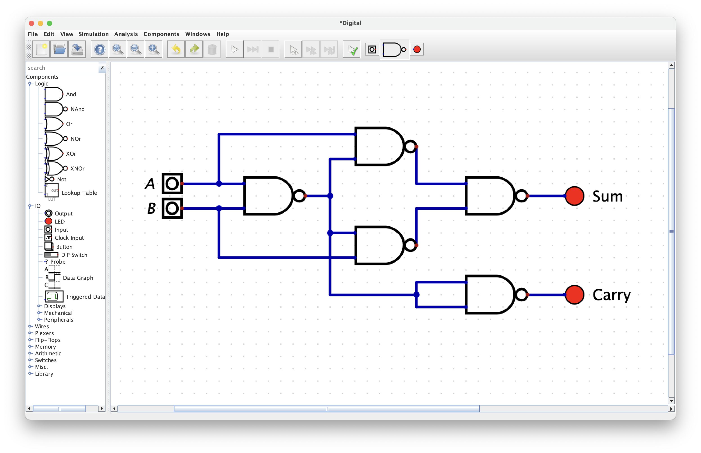
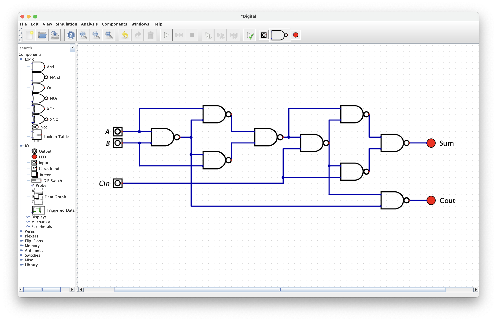

ในสัปดาห์นี้จะเป็นการต่อ Half Adder/Full Adder บน Breadboard และใช้ 74HC00N/74HC00P เป็น IC ที่ใช้ในการต่อวงจร

หน้าตาของ 74HC00N/74HC00P

Full Adder บน Breadboard

## Functionally Complete

เราจะกล่าวว่าเซตของ logic gate ใด ๆ เป็น **functionally complete** ก็ต่อเมื่อเราสามารถสร้างวงจร logic ใด ๆ ได้ด้วย logic gate ที่อยู่ในเซตนั้น ๆ โดยใช้เพียงอย่างเดียว เช่น เซตของ not, and, และ or เป็นต้น

## NAND และ NOR

NAND และ NOR ทั้งคู่เป็น functionally complete ซึ่งหมายความว่าเราสามารถสร้างวงจรใด ๆ ได้ด้วย NAND หรือ NOR เพียงอย่างเดียว

### NAND

### NOR

> เนื่องจาก IC ที่เราใช้คือ 74HC00N/74HC00P ซึ่งเป็น NAND Gate 4 ช่อง ดังนั้นเราจะใช้ NAND Gate ในการสร้างวงจรต่าง ๆ

## การต่อ Half Adder ด้วย NAND

## การต่อ Full Adder ด้วย NAND

