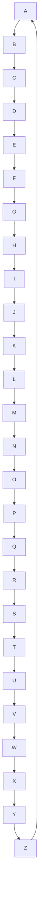

## Karnough Map

Karnough Map หรือ K-Map เป็นเทคนิคสำหรับใช้ในการลดรูปของสมการ boolean นอกจากนี้แล้วยังสามารถใช้ในการหา Hazard ในวงจรได้อีกด้วย

## Hazard

```mermaid
graph TB
    A --> B
    B --> C
    C --> D
    D --> E
    E --> F
    F --> G
    G --> H
    H --> I
    I --> J
    J --> K
    K --> L
    L --> M
    M --> N
    N --> O
    O --> P
    P --> Q
    Q --> R
    R --> S
    S --> T
    T --> U
    U --> V
    V --> W
    W --> X
    X --> Y
    Y --> Z
    Z --> A
```
