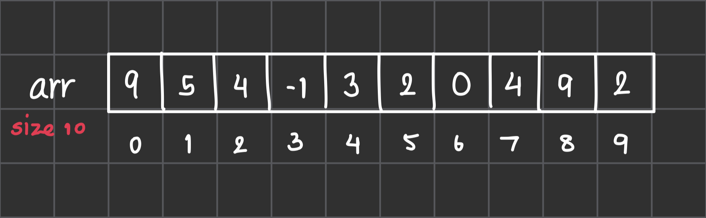
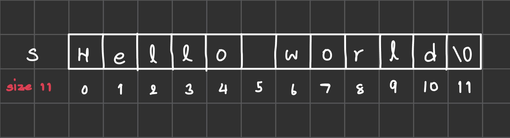
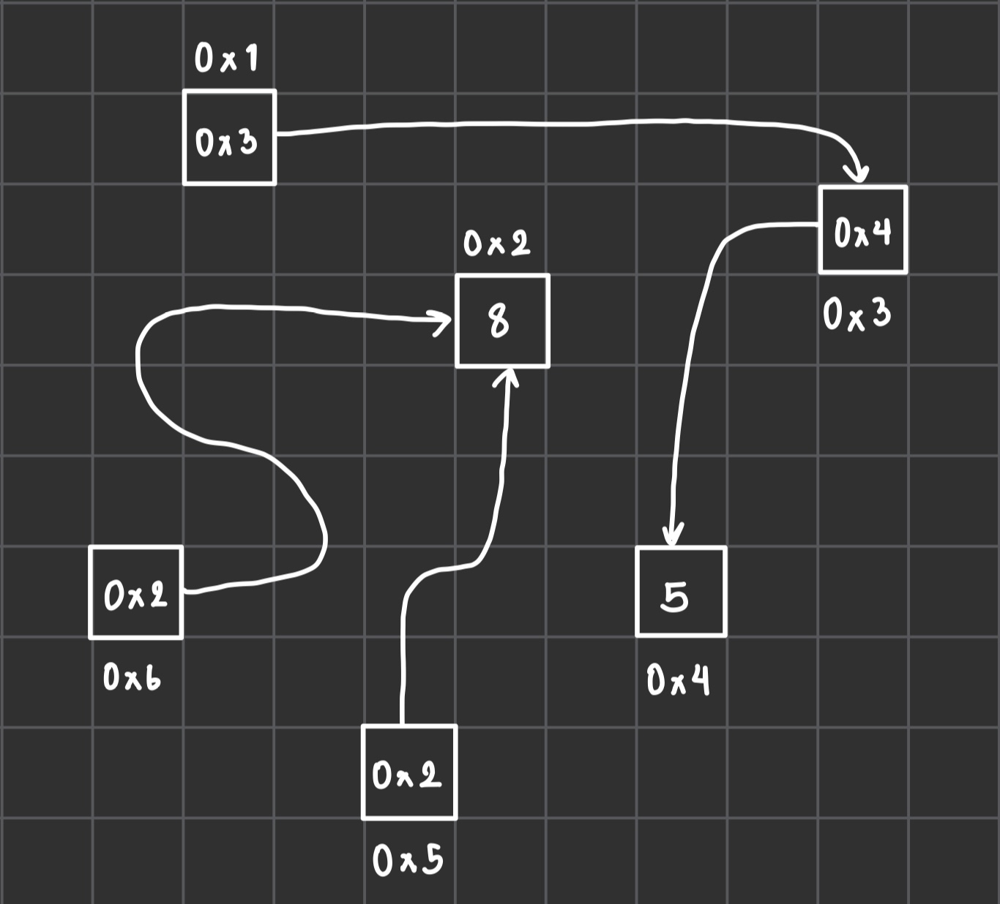

## Array



### What is Array ?

`Array` คือ โครงสร้างข้อมูลประเภทหนึ่งที่มีหน้าที่ในการเก็บตัวแปรประเภทเดียวกันไว้ติดกัน ซึ่งขนาดของ array เมื่อประกาศแล้วจะไม่สามารถแก้ไขได้

โดยวิธีการประกาศ Array นั้นแบ่งได้หลัก ๆ 2 แบบได้แก่

- `แบบที่ 1`: ระบุขนาดที่ต้องการใช้
- `แบบที่ 2`: ระบุสมาชิกที่อยู่ใน array

```cpp
int arr1[10]; // แบบที่ 1 ประกาศขนาดไว้ว่าจะใช้ 10 ช่อง แต่ยังไม่ได้ระบุค่าไว้ในแต่ละช่อง
int arr2[] = {1, 2, 3, 4}; // แบบที่ 2 ประกาศว่ามีสมาชิกคือ 1, 2, 3 และ 4 ซึ่งมีทั้งสิ้น 4 ช่อง
```

และ เรายังสามารถเข้าถึงค่าที่อยู่ใน Array ได้ผ่านทาง `index` ด้วย

Index
: ตำแหน่งที่ใช้ในการเข้าถึงข้อมูลต่าง ๆ ใน Array ซึ่งจะเริ่มจาก 0 (สมาชิกตัวแรก) ไปจนถึง n-1 (สมาชิกตัวสุดท้าย) เมื่อ n คือขนาดของ array

```cpp
int arr[] = {1, 2, 3, 4, 5};

arr[0] = 3; // แก้ไขค่าของสมาชิกตัวแรกเป็น 3

cout << arr[0] << ' ' << arr[4] << '\n';
```

### Example

`โจทย์` จงเขียนโปรแกรมเพื่อหาว่าใน Array ที่มีสมาชิก $$ N $$ ตัว มีสมาชิกคู่ใดที่สามารถรวมกันแล้วมีค่าเท่ากับ $$ X $$ หรือไม่

ข้อมูลนำเข้า

- จำนวนเต็ม $$ N $$ และ $$ X $$ แทน ขนาดของ Array และ จำนวนที่ต้องการทราบ
- จำนวนเต็ม $$ N $$ ตัว แทน สมาชิกแต่ละตัวใน Array

ข้อมูลส่งออก

- ข้อความ "Yes" หรือ "No" เพื่อบอกว่า มีสมาชิกคู่ใดใน Array ที่มีผลรวมเท่ากับ $$ X $$ หรือไม่

```cpp
#include <iostream>

using namespace std;

int main() {
    int n, x;
    cin >> n >> x;

    int arr[n];

    for (int i=0; i<n; i++) {
        cin >> arr[i];
    }

    bool found = false;
    for (int i=0; i<n; i++) {
        for (int j=i+1; j<n; j++) {
            if (arr[i] + arr[j] == x) {
                found = true;
            }
        }
    }

    if (found) {
        cout << "Yes\n";
    } else {
        cout << "No\n";
    }
}
```

### Practice Problems

- [Matrix Addition](https://programming.in.th/tasks/0003)
- [Modulo](https://programming.in.th/tasks/0011)
- [Seven Dwarves](https://programming.in.th/tasks/0013)
- [Reseto](https://programming.in.th/tasks/0018)
- [Pet](https://programming.in.th/tasks/0020)
- [World Cup](https://programming.in.th/tasks/0028)

## String



### What is String ?

`String` คือ ข้อความหรือลำดับของตัวอักษรที่เรียงติดกัน เราสามารถเข้าถึงตัวอักษรแต่ละตัวใน string ได้ผ่านทาง index โดยเริ่มจาก `0` ไปจนถึง `n-1`

```cpp
string s;
s = "Hello World";

cout << "s: " << s << '\n';
```

เราสามารถแก้ไขค่าของตัวอักษรแต่ละตัวได้ผ่าน `index`

```cpp
string s;
s = "Cat";

s[0] = 'B';

cout << "s: " << s << '\n';
```

สามารถนำ String 2 ตัวมาต่อกันได้โดยใช้เครื่องหมาย `+`

```cpp
string s1 = "Hello ";
string s2 = "World!";

string s3 = s1 + s2;

cout << "s3: " << s3 << '\n';
```

### String Terminology

- `concatenation` คือ การนำ string ตั้งแต่ 2 ตัวขึ้นไปมาต่อกัน เช่น
    - "ab" + "cd" = "abcd"
- `substring` คือ string ย่อยที่อยู่ใน string ใหญ่ (ตัวอักษรต้องอยู่ติดกัน) เช่น
    - "abc" เป็น substring ของ "abcd"
    - "ad" ไม่เป็น substring ของ "abcd"
- `subsequence` คือ ลำดับย่อยที่อยู่ใน string ใหญ่ (ตัวอักษรไม่จำเป็นต้องอยู่ติดกัน) เช่น
    - "abc" เป็น subsequence ของ "abcd"
    - "ad" เป็น subsequence ของ "abcd"
    - "adc" ไม่เป็น subsequence ของ "abcd"

### Example

`โจทย์`: จงเขียนโปรแกรมรับจำนวนเต็ม $$ N $$ และข้อความ $$ s $$ โดยหน้าที่ของคุณคือการซ้ำตัวอักษรแต่ละตัวในข้อความทั้งสิ้นจำนวน $$ N $$ ครั้ง เช่น `s = "help"` และ `N = 3` จะได้ `hhheeelllppp`

ข้อมูลนำเข้า

- จำนวนเต็ม $$ N $$ แทน จำนวนของตัวอักษรที่ถูกทำซ้ำ
- ข้อความ $$ s $$ แทน ข้อความที่ต้องการทำซ้ำ

ข้อมูลส่งออก

- ข้อความที่ผ่านกระบวนการทำซ้ำแล้ว

```cpp
#include <iostream>

using namespace std;

int main() {
    int n;
    string s;
    cin >> n >> s;

    for (int i=0; i<s.length(); i++) {
        for (int j=0; j<n; j++) {
            cout << s[i];
        }
    }

    return 0;
}
```

### Practice Problems

- [Character Checker](https://programming.in.th/tasks/0004)
- [Ptice](https://programming.in.th/tasks/0016)
- [Kemija](https://programming.in.th/tasks/0021)
- [BUKA](https://programming.in.th/tasks/0025)
- [3-11](https://programming.in.th/tasks/0030)

## Pointer



### What is Pointer ?

`Pointer` คือ ตัวแปรที่ใช้สำหรับเก็บข้อมูลที่อยู่ (address) ของตัวแปรตัวอื่น

```cpp
int x = 5;
int* ptr = &x; // ตัวแปร ptr เก็บที่อยู่ของ x

cout << *ptr << '\n'; // ใส่ * นำหน้าตัวแปรประเภท pointer เพื่อดูค่าใน address ที่เก็บไว้
```

- `&x` คือ การถามที่อยู่ของ x
- `*x` คือ การถามค่าของที่อยู่ที่ x เก็บ (ในกรณีที่ x เป็น pointer)

### Examples

`โจทย์`: จงเขียนโปรแกรมสลับค่าระหว่างตัวแปร x และ y โดยใช้ pointer

```cpp
void fn_swap(int *x, int *y) {
    int tmp = *x;
    *x = *y;
    *y = tmp;
}
```
